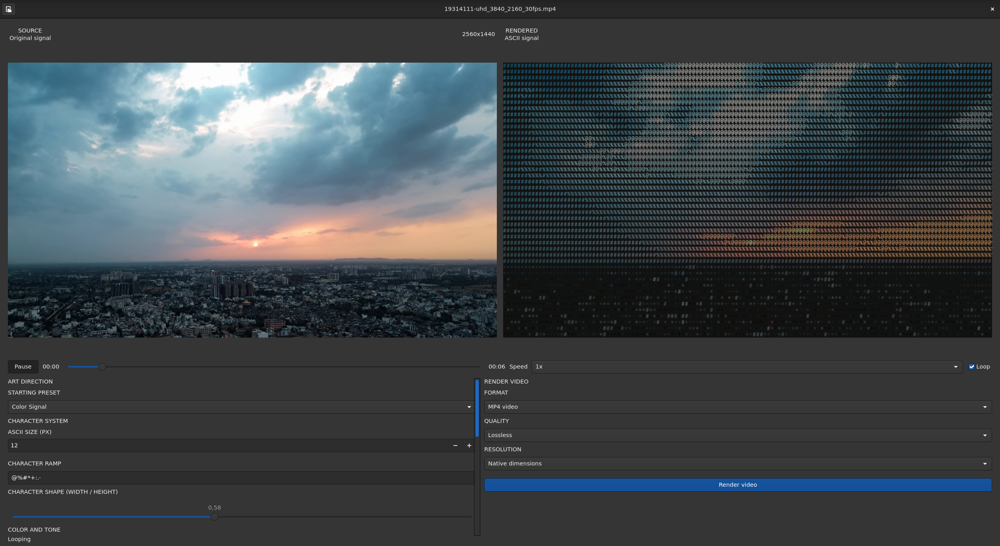

# ASCII Video

ASCII Video is a GTK4 video player that renders frames as ASCII art. It uses
GStreamer for playback and a multithreaded CPU renderer for the preview and
exports. The preview works without OpenGL or Vulkan and follows the system GTK
theme.



## features

- live source and ASCII previews
- seeking, playback speed, and looping
- JetBrains Mono glyphs
- custom ramps, colors, palettes, and tone controls
- presets, thresholding, inversion, and saturation
- MP4, MOV, animated PNG, and GIF export
- lossless MP4/MOV mode by default
- bounded multithreaded 4K rendering with ordered output
- native, preview, half-native, and custom output resolutions

## dependencies

the Nix flake provides the development dependencies:

- GTK4
- Cairo
- GStreamer with app, video, libav, and x264 support
- libepoxy
- FFmpeg
- CMake and a C11 compiler

JetBrains Mono should be installed and visible to Fontconfig. Cairo uses its
configured fallback font if it is missing.

## build and run with Nix

```sh
nix develop --no-write-lock-file path:.
cmake -S . -B build -DCMAKE_BUILD_TYPE=Release
cmake --build build -j
./build/ascii-video [path/to/video]
```

or:

```sh
nix run . -- [path/to/video]
```

the app also has an open button for choosing another video.

## build without Nix

```sh
cmake -S . -B build -DCMAKE_BUILD_TYPE=Release
cmake --build build -j
./build/ascii-video [path/to/video]
```
